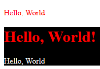
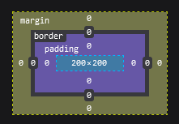

# Pertemuan 19 - Recap Materi CSS

## Pendahuluan

Di pembuatan halaman html terkadang kita ingin mengubah beberapa bentuk elemen untuk sesuai dengan ke-inginan kita, hal ini dapat di selesai kan dengan menggunakan CSS, cara penambahan CSS ada 3 cara, memakai attribute `style=''`, memakai elemen `<style>`, dan juga memakai file luar

### Cara Penambahan dengan File Luar

Untuk penambahan file CSS luar kita harus memiliki file CSS `.css` lalu kita memakai elemen `<link>` untuk men-import file css tadi `<link rel='stylesheet' href='path-menuju-file.css' />` elemen ini ditaruh ke dalam `<head>`, perlu di-ingat `href` itu bisa di-isi secara relative, absolute, untuk relative kita tinggal menambahkan `./` di bagian awal itu nanti membuat kita scan di folder yang file html itu berada dulu, untuk absolute di mulai dengan `/`

## Penggunaan CSS Style di attribute `style=''`

Ini sangat mudah dilakukan kita tinggal cari elemen yang ingin kita ubah bentuknya lalu di-tambahkan attribute tadi, setelah itu isi dari attribute kita isi dengan bahasa CSS, untuk menambahkan banyak CSS di dalam attribute harus dipisah dengan `;`

Contoh :

```html
<p style='color: red; background-color: black'>Hello, World!</p>
```

Dari contoh kode di-atas akan menghasilkan :


## Penggunaan CSS Style di `<style>` dan file `.css`

Cara-penggunaan dari kedua cara tersebut hampir mirip, karena `<style>` sebenernya memberitahu kalau di dalam elemen tersebut merupakan bahasa CSS, sebelum kita bahas cara-nya kita harus membahas CSS Selector, karena CSS yang ini bisa bersifat global, jadi untuk memberikan CSS kepada spesifik elemen harus di _select_ dulu.

### CSS Selector

#### Global

Yang pertama ialah Global Selector penulisannya seperti ini `*`, sesuai namanya ini membuat semua elemen terkena CSS yang di definisikan di dalam `*`.

```css
* {
    color: red;
    background-color: black;
}
```

Ketika dicoba halamannya akan memiliki background hitam dan warna teks menjadi merah.

#### Element Selector

Yang kedua ialah Element Selector, penulisannya sesuai dengan nama elemen yang mau di _select_ tetapi tidak ada `<>`, ini akan membuat semua elemen yang di _select_ terkena CSS yang di definisikan.

```css
p {
    color: red;
    background-color: black;
}
```

Ketika dicoba semua elemen `<p>` akan memiliki background hitam dan warna teksnya merah

### Class Selector

Yang ketiga ialah Class Selector, ini akan sering kita gunakan ketika membuat halaman web kita bagus, penulisannya hanya `.nama-class`, nama class itu bebas mau di-isi apa, pastikan nama-nya mudah dipaham, untuk memberi elemen html kita class tinggal menambahkan attribute `class=''` didalamnya, dapat support banyak class tetapi dipisah dengan spasi jadi kalau class selector tidak boleh memiliki spasi.

```css
.color-red {
    color: red;
}

.color-white {
    color: white;
}

.bg-black {
    background-color: black;
}
```

lalu di HTML

```html
<p class='color-red'>Hello, World</p>
<div class='color-red bg-black'>
    <h1>Hello, World!</h1>
    <p class='color-white'>Hello, World</p>
</div>
```

Kode di-atas akan menghasilkan :



### Attribute Selector

Selector yang ini jarang dipakai, cara penulisannya `[nama-attribute]`

```css
[data-merah] {
    color: red;
}
```

```html
<p data-merah>...</p>
```

## Macam-Macam perintah CSS

Karena perintah CSS ada banyak kita hanya akan menyinggung sedikit saja dan kita lanjutkan besok, kita akan melompati `color` dan `background-color` karena kita sudah memakainya berkali-kali pasti sudah tau effect-nya apa, untuk warna-nya bisa memakai bahasa inggris, rgba(xxx,xxx,xxx,xxx), atau memakai hex (#ffff).

Sebelum kita langsung membahas, kita harus paham konsep Box di HTML Elemen, jadi bayangin aja setiap elemen itu merupakan box, setiap box memiliki dimensi yang berbeda-beda dan kita bisa mengaturnya.



Yang di-tengah atau warna biru merupakan ukuran lebar dan tinggi suatu konten di elemen bagian ini disebut `width & height`, dan warna ungu merupakan spacing antara konten dan bagian yang terlihat di suatu elemen bagian ini disebut `padding`, dan warna kuning merupakan pembatas yang tak terlihat ini sering dipakai untuk memberi sela bagian ini disebut dengan `margin`.

Jangan khawatir nama-nama di-atas nanti tidak akan asing lagi kalau kita sudah selesai membahas CSSnya.

### Align Text

CSS ini digunakan untuk align teks kalau pernah memakai Microsoft Word nah itu sama persis

```html
<p style='text-align: center'>Hello, World</p>
```

yang dapat di-isi di text-align

- center
- end
- justfiy
- left
- right
- start

### Font Size

CSS ini sesuai dengan namanya digunakan untuk mengatur ukuran teks, CSS ini dapat di-isi menggunakan `px`, `rem`, ataupun `%`.

```html
<p style='font-size: 1.25rem'>...</p>
```

### Font Family

CSS ini digunakan untuk mengganti font suatu text, kalau sering menggunakan Microsoft Word pasti tau, karena Font Family yang ada berbeda beda di setiap komputer/sistem operasi yang paling aman ialah `monospace` CSS ini dapat di-isi banyak value dipisah menggunakan `,` jika yang paling kiri tidak ada akan menggunakan yang selanjutnya.

```html
<p style='font-family: monospace, sans-serif'>...</p>
```

### Font Weight

CSS ini digunakan untuk mengatur ketebalan suatu teks, inputnya ialah antara 100-900.

```html
<p style='font-wight: 200'>...</p>
```

### Height

CSS ini digunakan untuk mengatur ketiggian yang dimiliki suatu elemen, di dalam `height` dapat di-isi memakai `%`, `rem`, `px`, `vw`, `vh`, `vw` dan `vh` ini mengikuti dengan ukuran layar browser w untuk width/lebar dan h untuk height/tinggi.

```html
<body style='height: 100vh; background-color: black'></body>
```

### Width

CSS ini sama juga dengan yang Height tetapi yang di atur ukuran panjangnya

```html
<div style='height: 100vh; background-color: black'></div>
```

### Margin

CSS ini digunakan untuk memberi jarak antara elemen yang lain, CSS ini bisa di-isi `px`, `%`, `rem`, CSS ini juga ada beberapa macam dan penggunaanya.

- margin: atas kanan bawah kiri || semua
- margin-left
- margin-right
- margin-top
- margin-bottom

```html
<div style='width: 200px;height: 200px; background-color: black'></div>
<div style='width: 200px;height: 200px; background-color: red; margin: 2rem'></div>
<div style='width: 200px;height: 200px; background-color: yellow; margin: 1rem'></div>
<div style='width: 200px;height: 200px; background-color: blue; margin-left: 1rem'></div>
```

### Padding

Padding digunakan untuk memberi jarak antara konten dengan bordernya, CSS ini sama dengan margin.

- padding: atas kanan bawah kiri || semua
- padding-left
- padding-right
- padding-top
- padding-bottom

```html
<div style='width: 200px;height: 200px; background-color: black'></div>
<div style='width: 200px;height: 200px; background-color: red; padding: 2rem'></div>
<div style='width: 200px;height: 200px; background-color: yellow; padding: 1rem'></div>
<div style='width: 200px;height: 200px; background-color: blue; padding-left: 1rem'></div>
```

### Border

CSS ini digunakan untuk membuat garis tepi di suatu elemen HTML, CSS ini hampir mirip dengan Padding dan Margin serta memiliki beberapa perintah yang dapat membuat border kita lebih custom.

- border: atas kanan bawah kiri || semua
- border-left
- border-right
- border-top
- border-bottom
- border-radius (Ketumpulan di sisi border)
- border-color (Warna border)

Sekaian dulu untuk materinya akan dilanjut ke pertemuan selanjutnya.
