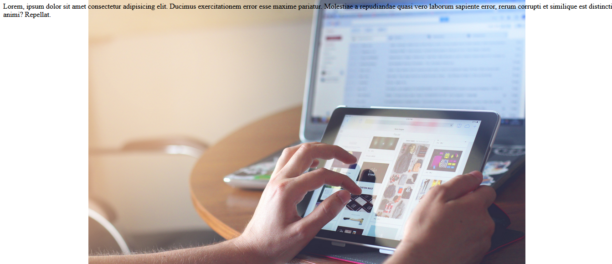
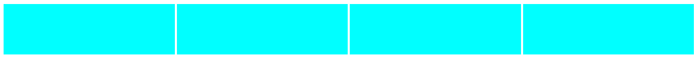
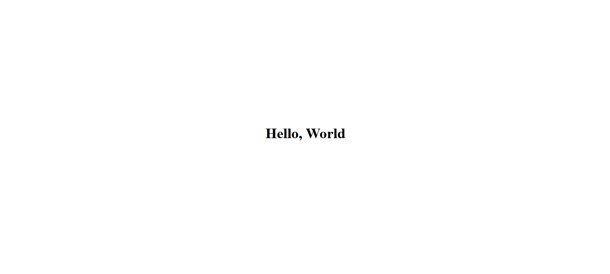
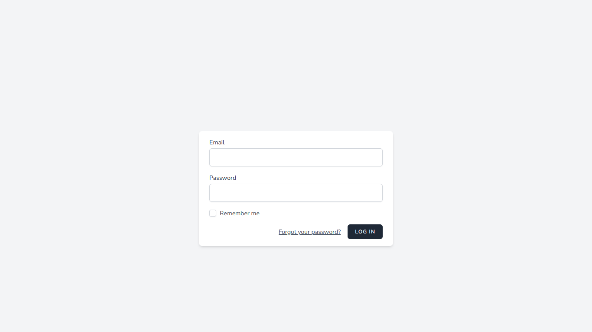

# Pertemuan 20 - Recap Materi CSS 2

## Pendahuluan

Kita akan membahas CSS yang belum dibahas di pertemuan 19, CSS ini akan sedikit ke-dalam jadi kalau belum baca yang ke-19 tolong dibaca terlebih dahulu agar dapat memahami konteksnya.

Materi yang akan kita bahas masih di definisi CSS dan ditambah dengan Media Query.

## Macam-Macam perintah CSS

### Opacity

CSS ini digunakan untuk memberikan tranparansi kepada elemen HTML, CSS ini hanya menerima `%` dan hanya 0-100%.

```html
<p style='opacity: 40%'>Hello, World!</p>
```

Dari contoh di-atas akan menghasilkan.


### Box Shadow

CSS ini digunakan untuk memberi effect bayangan di elemen HTML, CSS ini menerima banyak input, yang `offset`, `blur-radius`, sama `spread-radius` di-isi `px`, `rem`, `%`, dan color hanya dapat di-isi dengan warna dan biasanya berbentuk `#FFFF` atau `rgb(255,255,255)`.

- `box-shadow`: none;
- `box-shadow`: offset-x offset-y color;
- `box-shadow`: offset-x offset-y blur-radius color;
- `box-shadow`: offset-x offset-y blur-radius spread-radius color;

Contoh :

```html
<p style='box-shadow: 4px 8px 0.25rem 2px gray; padding: 1rem'>Hello, World!</p>
```

Hasil dari contoh di-atas :


### Overflow

Overflow ini memberitau elemen HTML ketika konten didalamnya melewati batasnya, CSS ini dapat memberikan `scrollbar` ketika kontennya telah melewati batas atau mungkin malah menyembunyikan `scrollbar`, CSS ini dapat mengatur di bagian koordinat `X` dan `Y`.

Ada banyak jenis overflow, overflow yang paling mudah sering kita pakai nantinya ialah :

- `overflow`
- `overflow-x`
- `overflow-y`

kalau dilihat `overflow` ini lebih mengarah ke `X` dan `Y` sedangkan `overflow-x` dan `overflow-y` kebalikannya.

Overflow dapat di-isi

- auto
- hidden
- scroll
- visible

Contoh :

```html
<p class='test' style='overflow: auto; width: 200px; height: 200px;'>
    Lorem ipsum dolor sit amet consectetur adipisicing elit.
    Aut, expedita! Esse, maxime ipsa repudiandae atque sequi voluptatibus, accusantium voluptate magni, itaque
    sint numquam nemo corporis facilis ad eum quam aperiam.

    Lorem ipsum dolor sit amet consectetur adipisicing elit. Pariatur perferendis corrupti blanditiis quibusdam,
    eligendi in doloremque nihil omnis harum voluptates aut accusamus repudiandae non labore quos assumenda
    temporibus repellendus. Nobis.
</p>
```


### Background Image

CSS ini hampir sama dengan `background-color` tetapi ini lebih mengarah ke gambar, CSS ini memiliki banyak customisasi agar kita bisa membuat background menjadi bagus dengan gambar.

1. `background-image` = menerima input `url(alamat-gambarnya)`.
2. `background-position` = digunakan mengatur posisi gambar di background, ini menerima beberapa input :
    - `bottom`
    - `center`
    - `left`
    - `right`
    - `top`
3. `background-repeat` = digunakan untuk mengatur pengulangan gambar, menerima input :
    - `no-repeat`
    - `repeat-y`
    - `repeat-x`
    - `repeat`
    - `round`
    - `space`
4. `background-size` = digunakan untuk mengatur ukuran background, menerima beberapa input :
    - `cover`
    - `contain`
    - `auto`

Contoh :

```html
<body
    style='background-image: url(./image.jpg); width: 100%; height: 100vh; background-position: center; background-size: contain; background-repeat: no-repeat;'>
    <p>Lorem, ipsum dolor sit amet consectetur adipisicing elit. Ducimus exercitationem error esse maxime pariatur.
        Molestiae a repudiandae quasi vero laborum sapiente error, rerum corrupti et similique est distinctio animi?
        Repellat.</p>
</body>
```

Dan hasilnya seperti ini



Note : URL di background-image tergantung local, atau dari internet, kalau local tinggal memakai file path, kalau di internet langsung menggunakan url yang mengarah di gambar tersebut.

### Flex

CSS ini digunakan untuk membuat layout halaman web menjadi lebih indah, CSS ini perlu banyak latihan karena dengan menggunakan `flex` kita bisa hampir semua jenis bentuk tampilan.

Beberapa definisi CSS yang bisa dipakai, dan sebelum menggunakan yang lain harus mendefinisikan `flex` di CSS `display` terlebih dahulu baru bisa menggunakan yang lainnya.

- `flex`
- `flex-direction`
- `flex-wrap`
- `flex-shrink`
- `flex-basis`
- `flex-flow`

Contoh :

```html
<div style='flex: auto;display: flex; flex-direction: row; width: 100%'>
    <div style='height: 100px; width: 25%; background-color: aqua; margin: 2px;'></div>
    <div style='height: 100px; width: 25%; background-color: aqua; margin: 2px;'></div>
    <div style='height: 100px; width: 25%; background-color: aqua; margin: 2px;'></div>
    <div style='height: 100px; width: 25%; background-color: aqua; margin: 2px;'></div>
</div>
```

Dan menghasilkan :



Kita bisa memakai flex untuk membuat elemen HTML di tengah tengah halaman, dengan `justify-content` untuk membuat konten rata kemana, dan `align-self` digunakan elemen yang ada di dalam elemen yang memiliki `flex` ini digunakan untuk mengatur posisi verticalnya, sedangkan `justify-content` untuk horizontalnya.

```html
<body style='height: 100vh; display: flex; justify-content: center;'>
    <div style='align-self: center;'>
        <h1>Hello, World</h1>
    </div>
</body>
```

Dan akan menghasilkan



Note : Karena pemakaian flex ini sangat flexible atau dengan kata lain hampir bisa dipakai di semua bentuk permasalahan layout suatu web, link untuk lebih lanjut <https://developer.mozilla.org/en-US/>

### Z Index

CSS ini digunakan untuk memberitau browser seberapa penting elemen ini agar ditampilkan dipaling depan, CSS ini menerima sebuah angka, dan cara mendefinisikan `z-index`.

## Media Query

`Media Query` ini merupakan suatu cara kita mendefinisikan CSS dengan ketentuan ukuran layar pemakai, hal ini sering disebut `Responsive`, cara memakainya cukup sederhana kita tinggal definisikan ukuran layar lebih atau kurang dan CSS didalamnya akan dijalankan sesuai dengan aturan ukuran layar yang didefinisikan.

```html
<style>
    /* Warna default */
    .myMediaQuery {
        color: red;
    }

    /* Jika lebar layar kurang dari 600px CSS ini dijalankan */
    @media screen and (max-width: 600px) {
        .myMediaQuery {
            color: blue;
        }
    }

    /* Jika lebar layar lebih dari 600px CSS ini dijalankan */
    @media screen and (min-width: 600px) {
        .myMediaQuery {
            color: green;
        }
    }
</style>

<p class='myMediaQuery'>Hello, World</p>
```

Jika ini dijalankan di komputer atau laptop teksnya akan bewarna hijau, jika lewat hp akan bewarna biru, di komputer atau laptop kita bisa mensimulasikan layar hp atau tablet dengan menggunakan `DevTool`, temen-temen bisa cari cara bukanya dimana, untuk pengguna Firefox tinggal pencet di keyboard `F12` nanti muncul sendiri lalu di sebelah kanan dekat tanda `X` ada gambar hp dan tablet berdampingan, nah itu yang nanti kita gunakan untuk mensimulasikan layar hp atau tablet.

## Note

Karena CSS ada banyak sekali temen-temen bisa mampir ke [W3School](https://www.w3schools.com/css/) atau [MDN](https://developer.mozilla.org/en-US/docs/Web/CSS/Cascade)

## Tugas

Membuat halaman login dengan desain yang diberikan boleh memakai Bootstrap atau CSS Framework lainnya tetapi kalau merasa pro bisa memakai CSS langsung tanpa framework.


