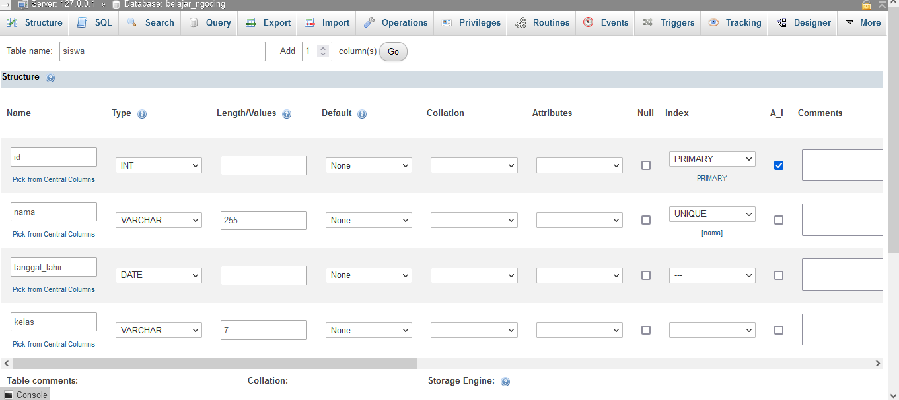

# Pertemuan 24 - Recap Materi Phpmyadmin

## Pendahuluan

Phpmyadmin merupakan suatu `dashboard` database `Mysql` dibawa oleh XAMPP, software ini dapat membantu kita dan menvisualisasikan apa yang terjadi di database tanpa kita harus paham bahasa `sql` yang nantinya dipakai di `Mysql`.

`Mysql` ini merupakan suatu sistem database(DBMS), database ini relational jadi database ini memiliki konsep tabel, kolom dan tabel dapat memiliki suatu relasi, kita akan membahasnya lebih detail dibawah.

Installasi tinggal mengunjungi website ini lalu ikut saja langkah langkahnya karena installasi tidak terlalu sulit.

<https://www.apachefriends.org/download.html>

## Menjalankan XAMPP

Setelah installasi selesai buka XAMPP control panel itu hidup didalam folder xampp, lalu nyalakan `Apache` dan `Mysql`, kalau warnanya hijau berarti berhasil di jalan dan siap dipakai, kalau ada error atau yang lainnya bisa ditanyakan biasanya yang paling sering itu kalau mempunyai program yang men-simulasikan android seperti bluestack atau vmware.

`Apache` merupakan web server yang dapat menjalankan script `php` kita dan phpmyadmin kita.

Lalu buka browser dan kunjungi <http://localhost/phpmyadmin> nanti akan muncul halaman Phpmyadmin.

Beberapa saya sensor karena rahasia negara😏

## Membuat Database

Pertama kita kali install hanya ada beberapa database yang ada untuk men-support `phpmyadmin` dan `Mysql` yang sebaiknya tidak kita sentuh sebelum kita bisa memakai Database kita harus membuatnya terlebih dahulu, untuk membuat klik tombol di bagian depan terdapat tulisan `Create Database` yang berarti kolom untuk membuat database, kita dapat isikan nama database yang kita inginkan tetapi yang saya contohkan nanti memakai nama belajar_ngoding.

Setelah di-isikan klik `create` langsung setelah itu muncul seperti ini.

## Membuat Tabel

Setelah membuat database sebelum kita bisa menyimpan data di Database kita harus membuat tabelnya terlebih dahulu. Kita dapat membuat tabel pertama kita dengan cara mengisi kolom yang input yang bertuliskan, kita juga dapat men-sepsifikan berapa kolom tabel kita, setelah itu di klik save untuk contoh saya akan membuat tabel yang namanya siswa dan 4 kolom tabel saja.

Setelah diklik Create, nanti akan muncul tampilan seperti ini

ada banyak sekali yang bisa di-input :

- `Name`
    merupakan nama kolom.
- `Type`
    merupakan tipe data yang boleh disimpan di kolom tersebut.
- `Length/Values`
    merupakan panjang data di kolom tersebut.
-`Default`
    data yang akan di masukan ketika penambahan data tidak diberikan suatu data.
- `Collation`
    itu encoding suatu string jangan disentuh kalau tidak tau apa isinya dan maksudnya apa.
- `Attributes`
    juga sama jangan disentuh karena data tetap tersimpan walaupun tidak di apa apakan kolom ini.
- `Null`
    yang bermaksud apakah data boleh tidak di-isi ketika data ditambah ataupun di update.
- `Index`
    merupakan kolom untuk memberikan identifikasi kepada tabel kita, terdapat macam macam tipe yang pertama :
        - `Primary` ini bermaksud kolom ini di spesifikan untuk menjadi patokan pada setiap data jadi tidak diperbolehkan data ganda dengan kolom ini, kolom ini akan juga menjadi target relasi, ini sering disebut `Primary Key`.
        - `Unique` ini hampir mirip dengan `Primary` tetapi tidak menjadi patokan suatu data tetapi tetap tidak diperbolehkan data ganda.
        - `Index` digunakan untuk emnandai suatu kolom menjadi bahan pencarian cepat.
        - `Fulltext` hampir sama dengan index tetapi lebih mengarah ke teks besar.
- `AI`
    atau dengan kata lain `Auto Increment` ini menandai Mysql untuk angka di kolom tersebut ditambah dengan 1 ini hanya support tipe data angka saja (Int dan kawan-nya)

### Sekilas tipe data yang ada di Mysql

- `Int`
    Merupakan tipe data angka tanpa ada koma.
- `Varchar`
    Merupakan tipe data teks yang memperbolehkan simbol dan tipe data ini hanya bisa menyimpan 255 karakter saja.
- `Text`
    Hampir sama dengan `Varchar` tetapi bisa lebih banyak, pakai ini kalau tidak tau panjang datanya seperti apa, kalau tau panjangnya dibawah 255 pakai `Varchar` saja.
- `Date`
    Merupakan tipe data tanggal

Dan ada tipe data yang lebih spesifik tetapi kita tidak terlalu mengkhawatirkan hal tersebut telenbih dahulu.

### Kembali melanjutkan tabel siswa

sekarang bayangkan tabel siswa pasti memerlukan nama, tanggal lahir, kelas nah kita akan membuat seperti itu, karena setiap data yang kita inginkan tidak ada duplikat kita juga menambah id sebagai penanda.

Setelah itu di klik create, atau temen-temen mau inspek `sql` yang akan di buat, nah kita bisa melakukan penambahan data dengan tab `Insert` diatas, di-isi lalu di create nanti akan muncul `sql` untuk kita review apa yang tadi dilakukan ini disebut `query`, kita bisa kembali ke tab `Browse`, untuk melihat data kita yang baru saja di tambahkan kita bisa hapus, edit dan delete.

## Membuat relasi

Sebelum kita membuat relasi, kita harus membuat tabel yang lagi karena relasi harus lebih dari 1 tabelnya, misalnya tabel absensi perpustakaan, kalau kita pikirkan pasti mengarah ke siswa lalu tanggal ketika absensi, nah itu tabel yang paling sederhana yang dapat kita buat dengan mudah, untuk membuat tabel lagi kita bisa klik `New` tepat dibawah nama database kita di sebelah kiri.

Kalau dilihat dengan baik terdapat kolom nama `user_id` ini akan digunakan untuk relasi, ingat yang mempunyai relasi harus menyimpan target idnya, secara konvensi penamaannya `namaTabel_id` setelah itu klik create.

Kita datang ke struktur tabelnya yang tadi kita buat, lalu masuk kedalam `Relation View`

Nanti akan muncul seperti ini setelah diklik tombolnya tadi

Di bagian sebelah kiri terdapat text input yang bertuilisan `Constraint Name` ini merupakan nama relasi yang kita buat bebas mau di tulis apa tetapi ditulis se-deskriptif mungkin, lalu ada `ON DELETE` dan `ON UPDATE` ini maksudnya jika tabel relasi yang tiduju ada data yang dihapus atau ada data yang update tabel ini akan juga kena atau tidak normalnya kita ganti dari `RESTRICT` menjadi `CASCASDE` agar juga ikut kehapus atau ke-update.

Lalu di sebelah kanan terdapat kolom yang pertama ini menuju kolom tabel kita, ini digunakan untuk menyimpan id tabel yang akan kita relasi, lalu diseblah kanannya terdapat tabel yang akan relasi, ada nama databasenya lalu ada tabelnya, setelah dipilih, kolom yang terakhir akan bisa diklik biasanya hanya dapat meng-klik kolom yang sudah di kasih `Primary` atau `Unique`.

Untuk contoh kali ini kita akan membuat relasi ke siswa, kalau sudah di klik save.

Nah setelah kita buat, kita bisa membuat data di tabel absensi_perpus, kita isi data bebas yang mengarah ke siswa yang kita buat pertama, lalu setelah selesai kita hapus data siswa di tabel siswa tadi lalu data absensi_perpus kita juga ikut dihapus

Kalau tidak paham relasi itu seperti apa yang dicontoh di-atas, konsepnya tabel absensi_perpus memiliki relasi dengan siswa jadi kalau misal ada sesuatu yang terjadi di tabel siswa tabel absensi_perpus juga kena, ini disebut `One to Many Relationship`.

## Menambah Data

Nah dari tadi membuat tabel, sekarang lanjut ke membuat data yang nantinya dimasukan ke tabel, untuk contoh kita menggunakan tabel siswa, pertama kita datangi terlebih dahulu tabel siswa lalu klik tab `insert`.

Lalu isikan kolomnya sesuai apa yang di-inginkan lalu klik go

