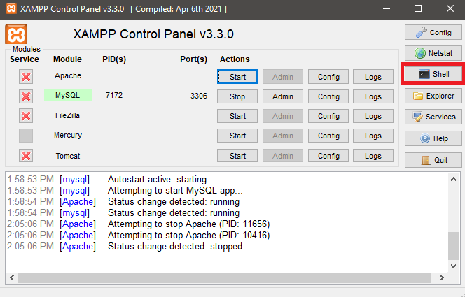
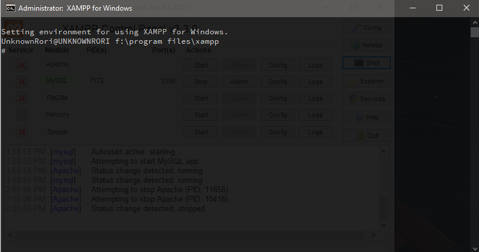
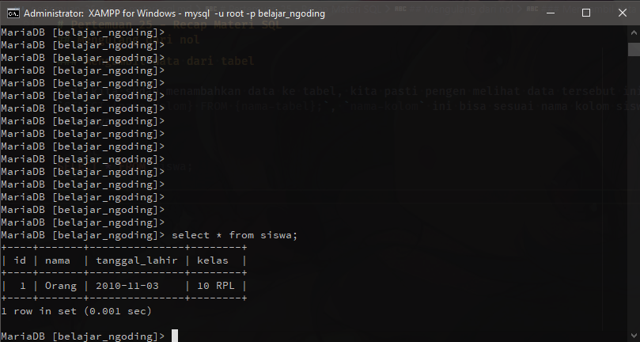
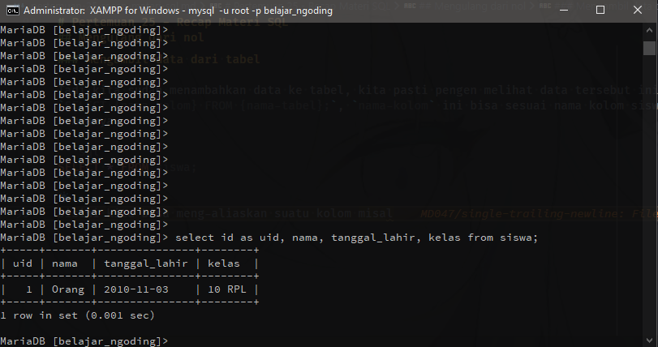
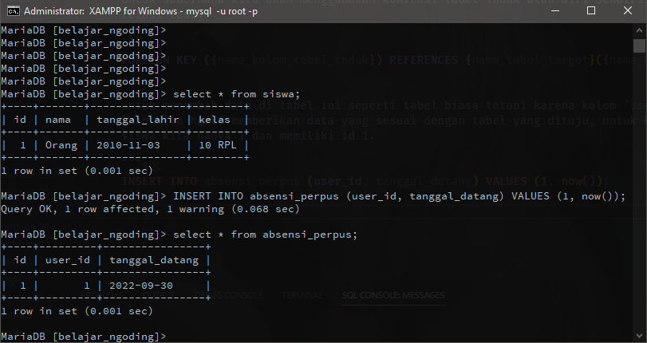
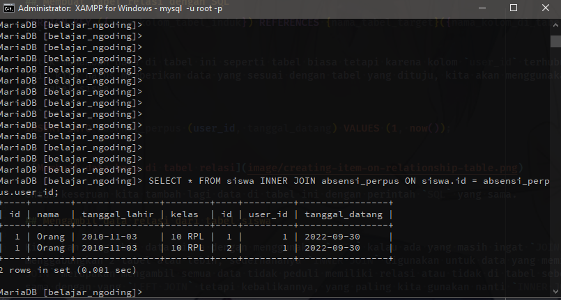
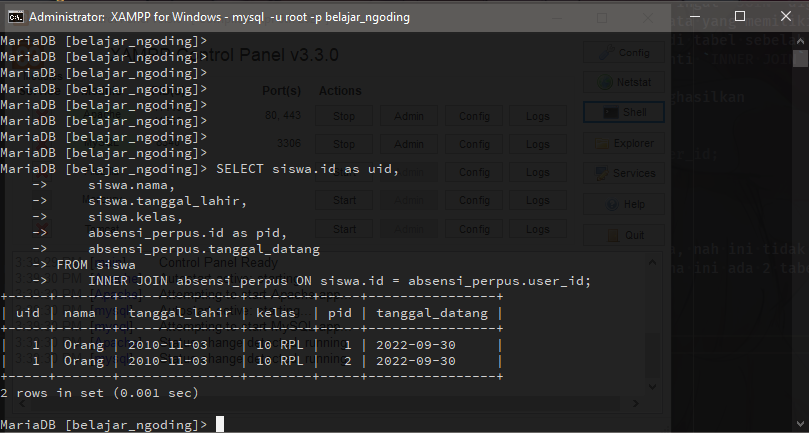

# Pertemuan 25 - Recap Materi SQL

## Pendahuluan

Kemarin kita sudah membahas penggunaan Phpmyadmin nah sekarang kita akan membahas kode `SQL` yang dibuat, kenapa kita harus belajar ini karena di bagian `backend` atau server pasti akan membutuhkan `SQL` untuk mejalankan `query` untuk mengambil suatu data, paling tidak tau konsepnya akan membantu kita dalam pembuatan aplikasi.

## Membuka Shell

Pertama-tama buka XAMPP, lalu nyalakan `Mysql` setelah menyala klik tombol `Shell`, `Shell` ini digunakan untuk mempermudah komunikasi kita kepada `Mysql` walaupun tidak ada tampilannya, kita bisa melakukan perintah `SQL` disini, atau temen-temen juga bisa buka Phpmyadmin lalu kunjungi tab `SQL`



Nanti akan muncul window baru menggunakan software command prompt milik windows (Kalau yang pakai windows)



## Login ke Mysql

Hal pertama sebelum kita memulai query kita lewat shell kita harus login terlebih dahulu, berbeda dengan di Phpmyadmin karena sudah dihandle secara otomatis(kalau passwordnya belum di ganti), untuk login kita ketik `mysql -u root -p` lalu ketik enter, ketika di suruh isi password langsung enter saja karena normalnya XAMPP tidak memiliki password, setelah login tampilannya seperti ini.


## Menampilkan database yang ada

Hal pertama ketika masuk di database `Mysql` kita harus tau nama nama database yang ada, ini dapat diselesaikan dengan perintah `show databases;` jangan lupa `;` karena ini merupakan `SQL`, kalau dijalankan kita akan mendapat tabel yang kita lihat di Phpmyadmin kemarin.


## Mengulang dari nol

### Menghapus Database kemarin

Karena kita di shell kita akan mengulang materi yang diajarkan di Phpmyadmin tetapi menggunakan `SQL` langsung, hal pertama yang akan kita lakukan ialah menghapus database kemarin dengan cara `drop database belajar_ngoding;`, lalu kita buat lagi database dengan nama yang sama, kenapa kita harus menghapus database kemarin agar kita mendapatkan fresh start, untuk membuat database kita bisa menggunakan perintah `SQL` `create database belajar_ngoding`, kita dapat mengecek databasenya sudah dibuat atau belum dengan perintah sebelumnya.

### Membuat tabel

Membuat tabel disini berbeda dengan di Phpmyadmin karena kita harus mengetik `query`-nya sendiri, hanya mengingat saja tabel siswa memiliki id, nama, tanggal lahir, kelas, untuk membuat tabel kita bisa menggunakan keyword `create table {nama-tabel} ({kolom});`, sebelum kita mulai membuat kita pindah tempat pengerjaan kita dengan keyword `use belajar_ngoding` setelah itu kita bisa membuat tabel dengan spesifikasi kolom tabel tersebut.

```sql
CREATE TABLE siswa (
 id INT PRIMARY KEY AUTO_INCREMENT,
 nama VARCHAR(255) UNIQUE,
 tanggal_lahir DATE,
 kelas VARCHAR(7)
);
```

kalau dilihat agak familiar sedikit dengan yang kemarin, kita ketikan langsung di shell tadi.


Kita bisa melihat struktur tabelnya dengan perintah `describe {nama-tabel};`, dan `show tables;` untuk menujukan list tabel didalam database tersebut.


Kalau dilihat banyak kolom yang bisa tidak di-isi ini bisa dilihat di kolom `Null` tertulis `Yes`, kita dapat melakukan update suatu tabel dengan perintah `ALTER TABLE {nama-tabel} {statement-update}`.

Statement update ini ada 3 :

- `MODIFY {nama-kolom} {tipe-data-dan-yang-lainnya};`
 Digunakan untuk men-edit suatu kolom.
- `ADD {nama-kolom} {tipe-data-dan-yang-lainnya};`
 Digunakan untuk menambah kolom baru di suatu tabel.
- `DROP {nama-kolom} {tipe-data-dan-yang-lainnya};`
 Digunakan untuk menghapus kolom.

Cara penggunaan statement ini mirip dengan `CREATE TABLE`

```sql
ALTER TABLE siswa MODIFY nama VARCHAR(255) UNIQUE NOT NULL;
ALTER TABLE siswa MODIFY tanggal_lahir DATE NOT NULL;
ALTER TABLE siswa MODIFY kelas VARCHAR(7) NOT NULL;
```

### Menambah Data

Untuk menambahkan data kita tinggal menggunakan keyword `INSERT INTO {nama-tabel} ({nama-kolom}) VALUES ({data});`, karena kolom di kabel kita memiliki tipe data tanggal / `DATE`, formatnya `YYYY-MM-DD` dari sebelah kiri merupakan tahun lalu bulan setelah itu tanggal.

```sql
INSERT INTO siswa (nama, tanggal_lahir, kelas) VALUES ('Orang', '2010-11-03', '10 RPL') 
```

Ini akan membuat data baru di tabel siswa dengan id ditambahkan langsung oleh `Mysql` karena kita memberikannya `AUTO_INCREMENT`.

Kita tambah satu lagi data siswa dengan query tadi tetapi dengan nama yang berbeda.

### Mengambil data dari tabel

Tadi kita sudah menambahkan data ke tabel, kita pasti pengen melihat data tersebut ini dapat dilakukan dengan `SELECT {nama-kolom} FROM {nama-tabel};`, `nama-kolom` ini bisa sesuai nama kolom siswa atau `*` yang bermaksud semuanya.

```sql
SELECT * FROM siswa;
```



Disini kita bisa meng-aliaskan suatu kolom misal kolom id dijadikan uid.

```sql
SELECT id AS uid, nama, tanggal_lahir, kelas FROM siswa;
```



## Membuat tabel relasi dengan SQL

Seperti dengan pertemuan yang kemarin kita akan membuat relasi, sebelum membuat relasi kita harus membuat tabel yang kita ingin relasi, hanya mengingat saja tabel tersebut hanya mimiliki 3 kolom saja id, user_id, tanggal_datang.

```sql
CREATE TABLE absensi_perpus (
 id INT PRIMARY KEY AUTO_INCREMENT,
 user_id INT NOT NULL,
 tanggal_datang DATE NOT NULL,
 FOREIGN KEY (user_id) REFERENCES siswa(id)
);
```

Kalau dilihat ini terdapat tuliasan `FOREIGN KEY` ini bermaksud untuk membuat relasi ini membutuhkan beberapa perintah tapi sederhananya.

Untuk sederhana kita akan menggunakan konvensi tabel induk atau diri sendiri, dan tabel target untuk tabel target relasi tadi.

```sql
FOREIGN KEY ({nama_kolom_tabel_induk}) REFERENCES {nama_tabel_target}({nama_kolom_di_tabel_target})
```

untuk menambah data di tabel ini seperti tabel biasa tetapi karena kolom `user_id` terhubung dengan tabel yang lain kita harus memberikan data yang sesuai dengan tabel yang dituju, kita akan menggunakan id 1 karena id 1 ada di tabel siswa.

```SQL
INSERT INTO absensi_perpus (user_id, tanggal_datang) VALUES (1, now());
```



Untuk keseruan kita tambah lagi data di tabel ini dengan perintah `SQL` yang sama.

## Mengambil data relasi dari tabel siswa

Kita akan mengambil data siswa dengan menggunakan `JOIN` kalau ada yang masih ingat `JOIN` digunakan untuk menggabungkan 2 tabel atau lebih, sederhananya `INNER JOIN` digunakan untuk data yang memiliki relasi, `LEFT JOIN` merupakan mengambil semua data tidak peduli memiliki relasi atau tidak di tabel sebelah kiri, `RIGHT JOIN` sama dengan yang `LEFT JOIN` tetapi kebalikannya, yang paling kita gunakan nanti `INNER JOIN`.

Kalau perintah `SQL` ini dijalankan dengan kondisi database saat ini akan menghasilkan

```sql
SELECT * FROM siswa INNER JOIN absensi_perpus ON siswa.id = absensi_perpus.user_id;
```



Kalau dilihat dari gambar tersebut terdapat kolom yang memiliki nama yang sama, nah ini tidak bagus untuk menangani masalah ini kita menggunakan aliasing seperti yang sebelumnya, karena ini ada 2 tabel kita harus menggunakan format `{nama-tabel}.{nama-kolom}`

```sql
SELECT siswa.id as uid,
    siswa.nama,
    siswa.tanggal_lahir,
    siswa.kelas,
    absensi_perpus.id as pid,
    absensi_perpus.tanggal_datang
FROM siswa
    INNER JOIN absensi_perpus ON siswa.id = absensi_perpus.user_id;
```

Nanti hasilnya seperti ini



Kalau teman teman masih bingung konsep `JOIN` bayangkan saja data tersebut sebagai himpunan.
