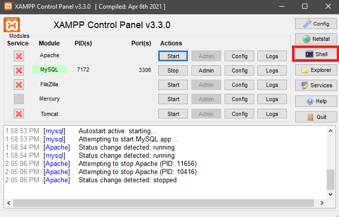
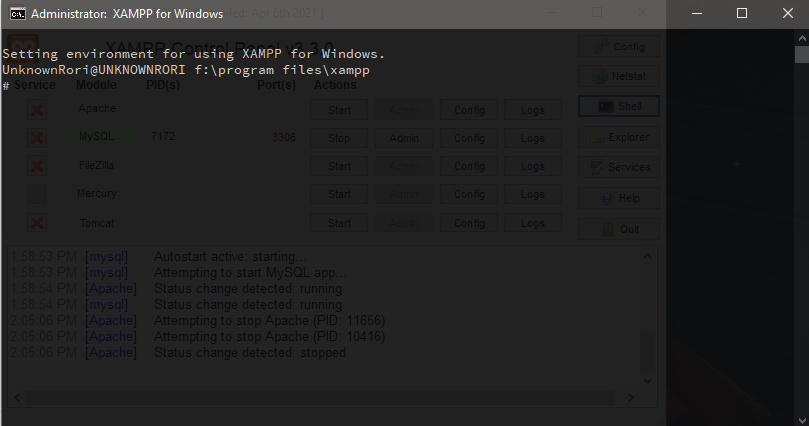
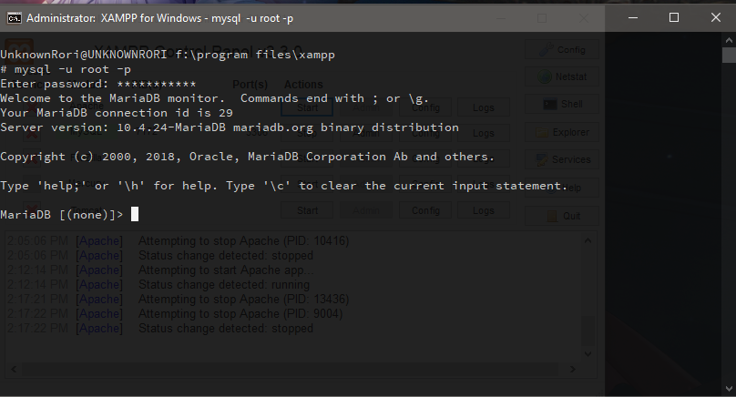
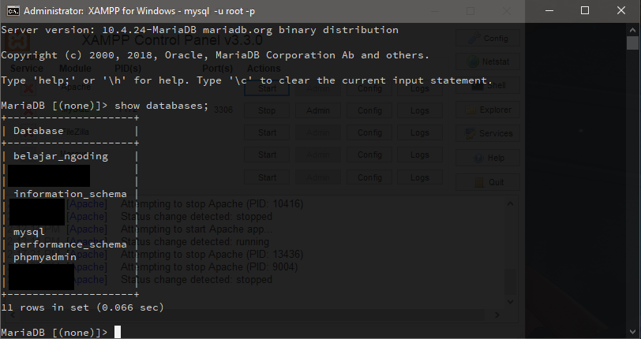
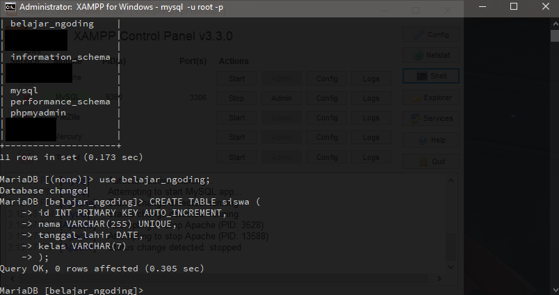
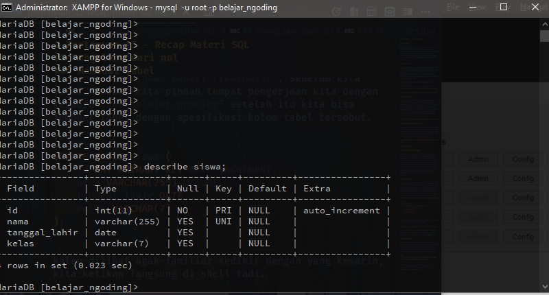

# Pertemuan 26 - Recap Materi SQL

## Pendahuluan

Kemarin kita sudah membahas penggunaan Phpmyadmin nah sekarang kita akan membahas kode `SQL` yang dibuat, kenapa kita harus belajar ini karena di bagian `backend` atau server pasti akan membutuhkan `SQL` untuk mejalankan `query` untuk mengambil suatu data, paling tidak tau konsepnya akan membantu kita dalam pembuatan aplikasi.

## Membuka Shell

Pertama-tama buka XAMPP, lalu nyalakan `Mysql` setelah menyala klik tombol `Shell`, `Shell` ini digunakan untuk mempermudah komunikasi kita kepada `Mysql` walaupun tidak ada tampilannya, kita bisa melakukan perintah `SQL` disini, atau temen-temen juga bisa buka Phpmyadmin lalu kunjungi tab `SQL`



Nanti akan muncul window baru menggunakan software command prompt milik windows (Kalau yang pakai windows)



## Login ke Mysql

Hal pertama sebelum kita memulai query kita lewat shell kita harus login terlebih dahulu, berbeda dengan di Phpmyadmin karena sudah dihandle secara otomatis(kalau passwordnya belum di ganti), untuk login kita ketik `mysql -u root -p` lalu ketik enter, ketika di suruh isi password langsung enter saja karena normalnya XAMPP tidak memiliki password, setelah login tampilannya seperti ini.



## Menampilkan database yang ada

Hal pertama ketika masuk di database `Mysql` kita harus tau nama nama database yang ada, ini dapat diselesaikan dengan perintah `show databases;` jangan lupa `;` karena ini merupakan `SQL`, kalau dijalankan kita akan mendapat tabel yang kita lihat di Phpmyadmin kemarin.



## Mengulang dari nol

### Menghapus Database kemarin

Karena kita di shell kita akan mengulang materi yang diajarkan di Phpmyadmin tetapi menggunakan `SQL` langsung, hal pertama yang akan kita lakukan ialah menghapus database kemarin dengan cara `drop database belajar_ngoding;`, lalu kita buat lagi database dengan nama yang sama, kenapa kita harus menghapus database kemarin agar kita mendapatkan fresh start, untuk membuat database kita bisa menggunakan perintah `SQL` `create database belajar_ngoding`, kita dapat mengecek databasenya sudah dibuat atau belum dengan perintah sebelumnya.

### Membuat tabel

Membuat tabel disini berbeda dengan di Phpmyadmin karena kita harus mengetik `query`-nya sendiri, hanya mengingat saja tabel siswa memiliki id, nama, tanggal lahir, kelas, untuk membuat tabel kita bisa menggunakan keyword `create table {nama-tabel} ({kolom});`, sebelum kita mulai membuat kita pindah tempat pengerjaan kita dengan keyword `use belajar_ngoding` setelah itu kita bisa membuat tabel dengan spesifikasi kolom tabel tersebut.

```sql
CREATE TABLE siswa (
 id INT PRIMARY KEY AUTO_INCREMENT,
 nama VARCHAR(255) UNIQUE,
 tanggal_lahir DATE,
 kelas VARCHAR(7)
);
```

kalau dilihat agak familiar sedikit dengan yang kemarin, kita ketikan langsung di shell tadi.



Kita bisa melihat struktur tabelnya dengan perintah `describe {nama-tabel};`, dan `show tables;` untuk menujukan list tabel didalam database tersebut.



Kalau dilihat banyak kolom yang bisa tidak di-isi ini bisa dilihat di kolom `Null` tertulis `Yes`, kita dapat melakukan update suatu tabel dengan perintah `ALTER TABLE {nama-tabel} {statement-update}`.

Statement update ini ada 3 :

- `MODIFY {nama-kolom} {tipe-data-dan-yang-lainnya};`
 Digunakan untuk men-edit suatu kolom.
- `ADD {nama-kolom} {tipe-data-dan-yang-lainnya};`
 Digunakan untuk menambah kolom baru di suatu tabel.
- `ALTER COLUMN {nama-kolom} {nama-kolom-baru};`
 Digunakan untuk menganti nama kolom

Note
