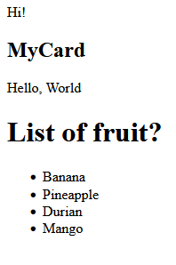
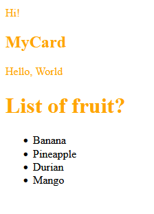
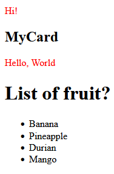
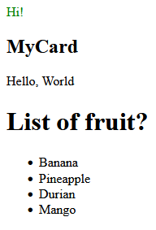

# Pertemuan 32 - Pendalaman CSS

## Pendahuluan

Pada pertemuan 20 kita membahas beberapa CSS, tetapi kita melewati beberapa konsep, nah untuk pertemuan kali ini kita akan mendalami CSS dan membahas apa saja yang belum dibahas seperti css selector in-depth, pseudo class, animation, flexbox in-depth, untuk keyword/perintah CSS bisa di cek di link dibawah.

## CSS Selector In-Depth

Kemarin kita mempelajari selector css yang tidak bisa men-select anak element, nah ini beberapa selector css yang saya tau yang berguna untuk men-select anak element, kenapa kita harus belajar ini, agar kita bisa memperbagus halaman website kita dan mengurangi duplikasi kode juga.

Untuk contoh kita akan menggunakan struktur HTML jadi kalau dipraktek-kan tolong diperhatikan hasilnya di browser

```html
<body>
    <div class="container">
        <p>Hi!</p>

        <div class="card">
            <h2>MyCard</h2>
            <p>Hello, World</p>
        </div>

        <h1>List of fruit?</h1>
        <ul>
            <li>Banana</li>
            <li>Pineapple</li>
            <li>Durian</li>
            <li>Mango</li>
        </ul>
    </div>
</body>
```

Hasilnya :



### Grouping Selector

Yang pertama ialah `Grouping Selector` apa sih itu, css ini digunakan untuk men-select element HTML lebih dari satu semisal :

```css
p, h2, h1 {
    color: orange;
}
```

Note : Selector ini dapat digabung dengan class selector atau yang lainnya.

Hasilnya :



### Descendant Combinator

Selanjutnya ialah Descendant Combinator, ini digunakan men-select anak element dengan menggunakan spasi setelah selector kita, selector ini dapat digabung dengan class selector atau yang lainnya, contoh :

```css
// Ini akan menselect semua tag p didalam div
div p {
    color: red;
}
```



### Direct Child Combinator

Kita juga bisa men-select yang hanya anaknya langsung, jadi kalau anak element terus anaknya lagi tidak bisa, contoh :

```css
.container > p {
    color: green;
}
```

Hasilnya :



Source :

<https://developer.mozilla.org/en-US/docs/Web/CSS/Reference>

<https://developer.mozilla.org/en-US/docs/Web/CSS/CSS_Selectors>
