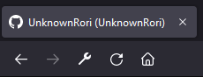
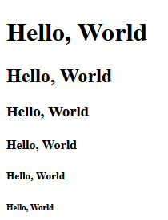
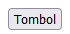
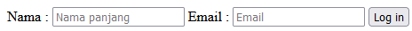
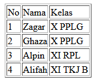
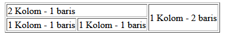

# Pertemuan 18 - Recap Materi HTML

## Pendahuluan

HTML atau Hyper Text Markup Language merupakan bahasa markup yang digunakan untuk membuat sebuah website, bahasa ini menggunakan sistem tag dan dapat didukung oleh Javscript dan CSS.

## Pembuatan File HTML

Untuk membuat file HTML dan dapat kita akses dengan browser kita membuat file .html lalu kita ketik pada baris pertama `<!DOCTYPE html>` tag ini menandai kalau ini merupakan HTML, lalu ganti baris `<html lang="en">` untuk membuka tag HTML ini disebelah kanannya `<html>` ada huruf lang ini sering disebut attribute, attribute ini biasanya memiliki bentuk nama-attribute=’isi’ karena mengunakan sistem tag kita harus menutup tag tersebut dengan menggunakan / seperti `</html>`, dan diantara tag `<html>` ada `<head>` dan `<body>`, sesuai namanya `<head>` tempat untuk menaruh meta data file html dan asset kita seperti Javascript atau CSS, dan `<body>` untuk konten website kita.

Contoh sederhana-nya

```html
<!DOCTYPE html>
<html lang="en">
    <head>
        <!-- Tempat untuk menyimpan meta data file html -->
    </head>
    <body>
        <!-- Tempat untuk konten website -->
    </body>
</html>
```

## Elemen di HTML

Di HTML terdapat tag seperti `<head>` ini disebut tag, dan untuk mudahnya kita langsung panggil aja elemen/html elemen yang berarti tag pembuka dan tag penutup, jadi perlu di-ingat kalau membuka tag html jangan lupa ditutup

### Title

Elemen yang pertama ialah judul atau `<title>`, elemen ini digunakan untuk memberi nama di tab browser kita ketika dibuka di browser

Contoh Cara kerja title :



Kalau dilihat dari gambar bisa disimpulkan seperti ini

```html
<head>
    <title>UnknownRori (UnknownRori)</title>
</head>
```

### Heading

Elemen ini merupakan heading sering digunakan untuk judul atau tulisan besar bentuk tag-nya `<h*>` kenapa kok ada * karena elemen ini dapat diberi angka 1 sampai 6, dan itu akan mempengaruhi teks yang di dalam elemen tersebut

```html
<body>
    <h1>Hello, World</h1>
    <h2>Hello, World</h2>
    <h3>Hello, World</h3>
    <h4>Hello, World</h4>
    <h5>Hello, World</h5>
    <h6>Hello, World</h6>
</body>
```

dan dari kode diatas akan menghasilkan



### Paragraph

Sesuai dengan namanya elemen ini digunakan untuk membuat paragraph karena secara default memiliki spacing di-antara elemen, untuk penulisan tagnya `<p>`, hasilnya di browser akan terlihat seperti teks biasa

Contoh :

```html
<body>
    <p>
        Lorem ipsum dolor sit amet, consectetur adipisicing elit. Quae ipsam laboriosam provident cupiditate magnam
        a porro quod nihil adipisci perspiciatis repellat et distinctio tempora nostrum, quisquam reiciendis!
        Aspernatur, tempora iure.
    </p>
</body>
```

### Image

Elemen yang satu ini digunakan untuk menambahkan gambar di halaman html, cara penulisan tagnya `` kenapa langsung di `/` karena elemen ini bisa langsung ditutup karena tidak ada yang bisa kita isi diantara tag tersebut, untuk elemen ini berjalan dengan benar kita harus menyediakan attribute `src='...'` yang mengarah ke file gambar/gif, dan juga bisa ditambah attribute `alt='...'` ketika gambar/gif tadi gagal di load, kita juga bisa menambah `width='...'` dan `height='...'` attribute ini digunakan untuk mengatur ukuran gambar.

```HTML
<body>
    
</body>
```

Dari kode di-atas nanti akan me-load gambar `image.png` jika gagal akan menampilkan `gambar orang memakai tablet`.

### Button

Elemen ini sering digunakan untuk membuat tombol karena secara default sudah dibentuk seperti tombol, cara penulisan tagnya `<button>`.

```html
<body>
    <button>Tombol ku</button>
</body>
```



### Link

Elemen ini sesuai dengan namanya membuat link terhadap website lain atau mungkin ke halaman lain di suatu situs entah milik kita atau orang lain, penulisan tagnya sangat mudah `<a>` untuk memastikan link berjalan dengan baik kita harus memberikan attribute `href=''` yang ditulis URL lengkap (`https://google.com`) atau relative (`/suatu-halaman`), kalau URL relative nanti akan mengarah di situs kita.

```html
<body>
    <a href='https://google.com'>Link ke Google</a>
</body>
```

### List

Sesuai dengan namanya Elemen ini digunakan untuk membuat List entah list suatu program, cara memasak, dll, cara penulisannya bermacam macam tetapi sebelum membuat List kita harus tau mau membuat list apa, kalau list yang ada angkanya `<ol>` kalau tidak ada angkanya `<ul>` dan di antara tag `<ol>` atau `<ul>` ini ada `<li>` yang akan menampilkan data kita dalam bentuk list.

Salah satu contoh dari `<ul>`

```html
<body>
    <ul>
        <li>Pisang</li>
        <li>Mangga</li>
        <li>Apel</li>
        <li>Jeruk</li>
    </ul>
</body>
```


### Grouping / Div

Elemen ini sering digunakan untuk pengelompokan macam macam elemen agar memudahkan untuk melakukan operasi entah itu memakai Javascript atau CSS, cara penulisan tagnya ialah `<div>` elemen yang ingin dimasukan ke pengelompokan tinggal dimasukan diantara tag tersebut.

```html
<body>
    <div>
        <!-- Elemen -->
    </div>
</body>
```

### Form

Elemen ini digunakan untuk mengambil input user, elemen ini juga harus digabungkan dengan elemen `<input>` agar dapat mengambil data yang di isi user dengan baik lalu untuk pengiriman data user harus memiliki 1 elemen `<input>` atau `<button>` yang memiliki attribute `type='submit'`, untuk penulisan elemen form ini `<form>` dan elemen ini memilki 2 attribute, yang pertama ialah `action=''` jadi setelah user meng-klik tombol yang submit nanti akan dilempar ke halaman yang di tulis di `action` tadi dan juga membawa data yang di-isi di form tadi, dan yang selanjutnya ialah `method=''` ini merupakan `http` method untuk saat ini kita tidak mempedulikannya.

Elemen `<input>` ini dapat menerima beberapa attribute penting yang pertama `name=''` attribute ini akan digunakan ketika kita mulai membuat website yang menggunakan server, lalu yang kedua attribute `placeholder=''` attribute ini akan menampilkan teks di dalam kolom input dan akan hilang ketika sudah di-isi, dan attribute yang terakhir ialah `type=''` attribute

Di beberapa website terkadang input memiliki teks di sebelah kanan atau di-atasnya ini mudah ditambah dengan cara menambah `<label>` di samping elemen yang ingin diberi teks.

```html
<body>
    <form>
        <label>Nama : </label>
        <input placeholder='Nama panjang' />
        <label>Email : </label>
        <input placeholder='Email' />
        <input type="submit" value="Log in" />
    </form>
</body>
```



### Table

Elemen yang terakhir ini digunakan untuk membuat tabel, cara penggunaanya hampir mirip dengan `<div>` dan `<ul>` atau `<ol>`, untuk membuat tabel kita membuat elemen `<table>` terlebih dahulu dan di-isi elemen `<thead>` untuk bagian baris paling atas dan lalu dibawahnya ada `<tbody>` untuk baris setelah baris pertama, sebenarnya `<tbody>` sama `<thead>` bisa dibuang, lalu di dalam-nya kita dapat menuliskan `<tr>` untuk memberi tau kalau kita ingin baris baru lalu `<td>` merupakan kolom, tabel menerima attribute `border='1'` yang dapat kita gunakan untuk membuat border tabel-nya secara otomatis.

```html
<body>
    <table border='1'>
        <thead>
            <tr>
                <td>No</td>
                <td>Nama</td>
                <td>Kelas</td>
            </tr>
        </thead>
        <tbody>
            <tr>
                <td>1</td>
                <td>Zagar</td>
                <td>X PPLG</td>
            </tr>
            <tr>
                <td>2</td>
                <td>Ghaza</td>
                <td>X PPLG</td>
            </tr>
            <tr>
                <td>3</td>
                <td>Alpin</td>
                <td>XI RPL</td>
            </tr>
            <tr>
                <td>4</td>
                <td>Alifah</td>
                <td>XI TKJ B</td>
            </tr>
        </tbody>
    </table>
</body>
```



Terkadang kita juga pengen beberapa kolom bisa gabung atau mungkin barisnya ini bisa di-selesaikan dengan cara menambahkan attribute kedalam `<td>`, attributenya ialah`rowspan=''` untuk berapa besar barisnya, dan `colspan=''` untuk berapa besar kolomnya

```html
<body>
    <table border='1'>
        <tr>
            <td colspan='2'>2 Kolom - 1 baris</td>
            <td rowspan='2'>1 Kolom - 2 baris</td>
        </tr>
        <tr>
            <td>1 Kolom - 1 baris</td>
            <td>1 Kolom - 1 baris</td>
        </tr>
    </table>
</body>
```


